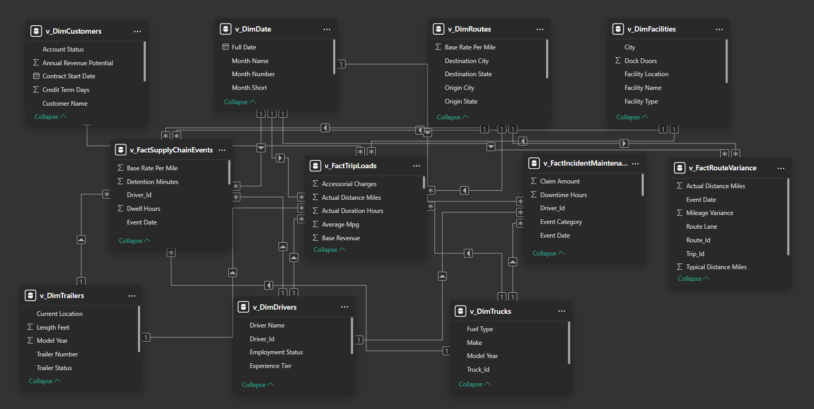

# Logistics Intelligence Command Center: Executive BI Suite

## 📌 Project Overview
This project transforms raw, transactional logistics data into a multi-page, interactive **Executive BI Suite**. Designed for a modern fleet operation, the dashboard provides a "single pane of glass" view across Financial Health, Operational Efficiency, Delivery Performance, and Fleet Safety.

---

## 🚀 Documentation & Quick Links

* 📊 [**View Executive Performance Report (PDF)**](Report_and_Dashboard/Fleet_Performance_Supply_Chain_Intelligence_Report.pdf)
  
* 🛠️ [**Download Power BI Dashboard (.pbix)**](Report_and_Dashboard/Logistics_Intelligence_Command_Center_v1.pbix)
  
* 💾 [**View SQL Gold-Layer Transformation Scripts**](SQL_Scripts/02_Gold_Reporting_Views.sql)

  ---
  
## 🖼️ Dashboard Gallery
| Navigation Page | Preview Link |
| :--- | :--- |
| **01. Home Portal** | [View Image](01_Home_Page.jpg) |
| **02. Executive Financial Overview** | [View Image](02_Executive_Financial_Overview.png) |
| **03. Operational & Asset Efficiency** | [View Image](03_Operational%20&%20Asset.png) |
| **04. Logistic & Delivery Performance** | [View Image](04_Logistic%20&%20Delivery.png) |
| **05. Fleet & Safety Management** | [View Image](05_Fleet%20&%20Safety.png) |

---

## 🛠️ Technical Stack
* **SQL Server (T-SQL):** Engineered a **"Gold Layer"** using complex Views to ensure data integrity and performance.
* **Power BI:** Developed a multi-page suite utilizing advanced DAX, SVG-based sparklines, and custom UI/UX design.
* **Data Modeling:** Implemented a **Star Schema** with centralized Fact tables and optimized Dimension tables.

## 📐 Data Modeling
The analytical model is designed as a **Star Schema**, ensuring efficient query performance and clear relationship management. This architecture allows for seamless filtering across all four reporting pillars.

  

---

## 🚀 Key Features & Analytical Deep Dives

### 1. Executive Financial Overview
* **Profitability Indexing:** Identifies "High-Yield" vs. "Bottom Performing" lanes using a diverging bar chart to pinpoint revenue leakage.
* **Efficiency Tracking:** Combines Revenue bars with a Profit Margin % line to monitor scale vs. profitability over a 12-month cycle.

### 2. Operational Efficiency
* **Detention Risk Heatmap:** A high-resolution heatmap visualizing wait times by facility, allowing managers to identify bottlenecks in real-time.
* **Mileage Variance Analysis:** Tracks the gap between planned vs. actual miles to improve route planning accuracy.

### 3. Logistic & Delivery Performance
* **SLA Reliability:** Routes ranked by on-time performance to identify service level risks.
* **Correlation Analysis:** A scatter plot investigating the direct impact of Hub Detention on overall Service Levels.

### 4. Fleet & Safety Management
* **Critical Failure Analysis:** Breakdown of unplanned repairs by component (Transmission, Brake, Engine) to guide preventative maintenance schedules.
* **Risk Profiling:** Correlates incident rates with driver tenure to inform training programs.

---

## 📈 Technical "Flex" (Advanced Implementation)
* **Custom SVG Sparklines:** Built using custom DAX measures to allow for dynamic "High/Low" point coloring and brand-consistent styling.
* **UX-First Design:** Implemented a "Dark Mode" UI with a custom navigation system, synchronized slicers, and a consistent "Glow" indicator for active pages.

---

## 💡 Business Impact
By centralizing these four distinct pillars of logistics, this suite allows stakeholders to move from **reactive** reporting to **proactive** strategy—reducing maintenance costs by identifying failing components early and recovering margins by optimizing low-performing routes.

---
**Author:** Meenakshi Singh | Data Analyst | SQL Engineering | Power BI Architecture

